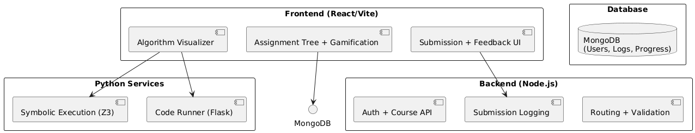
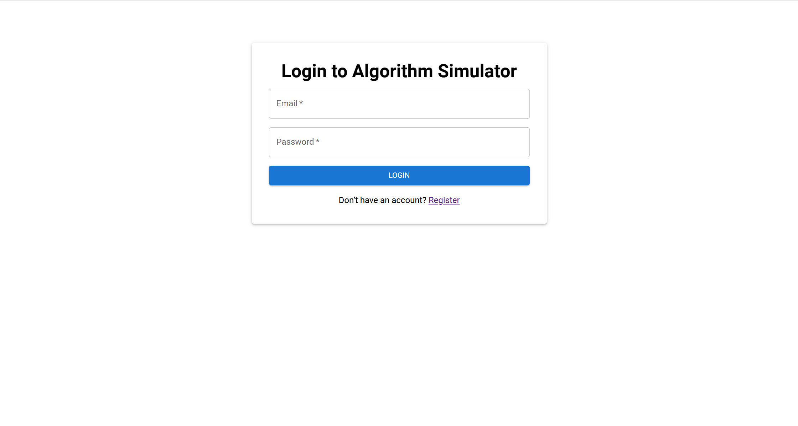
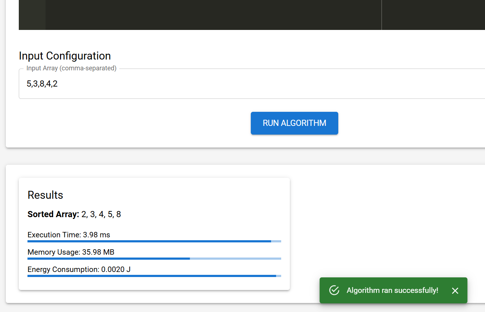
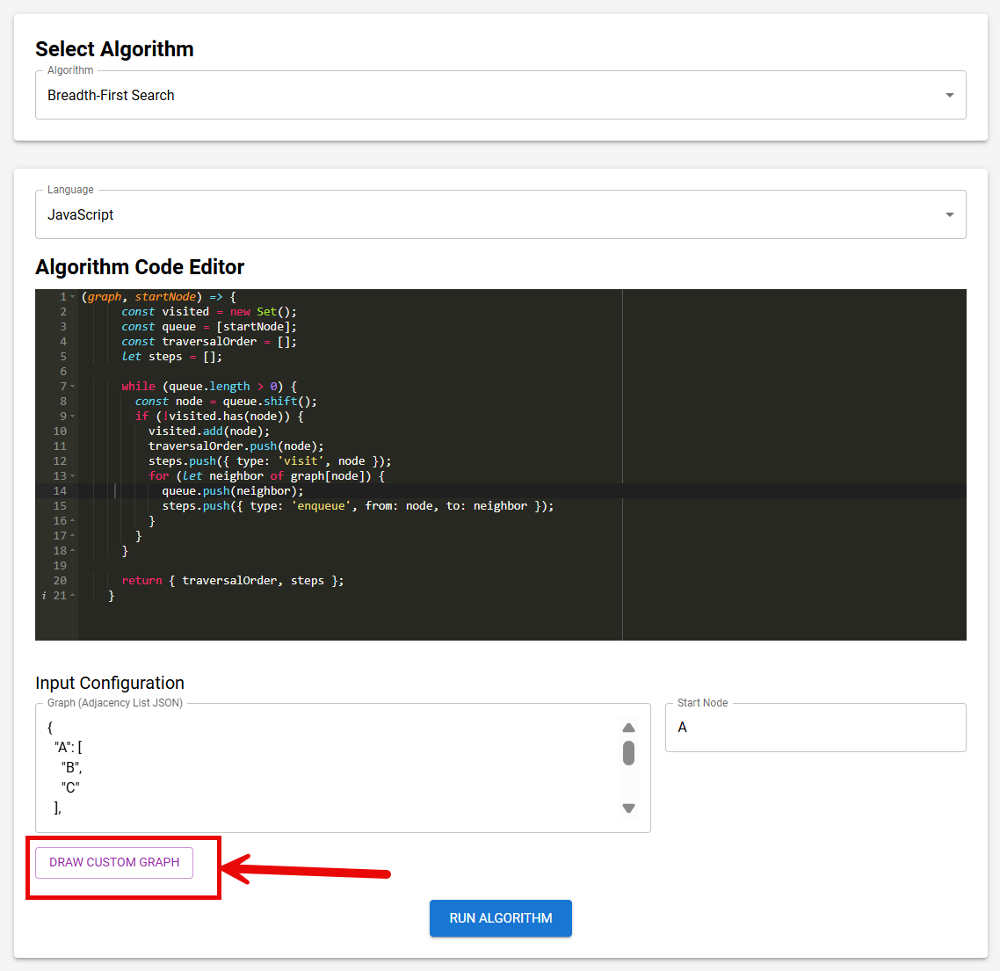
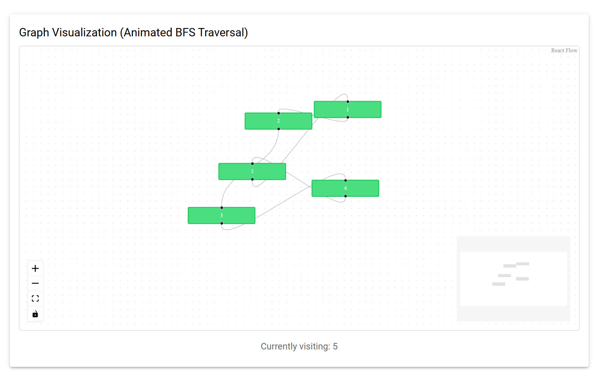
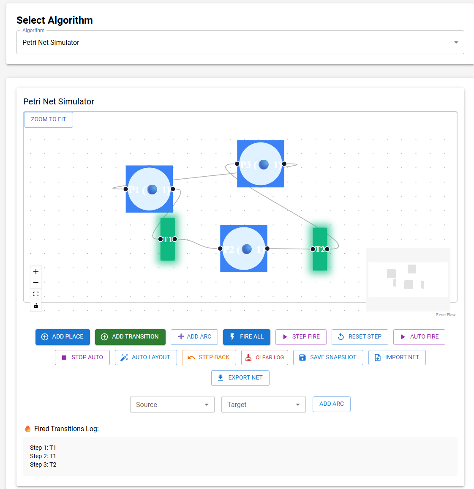
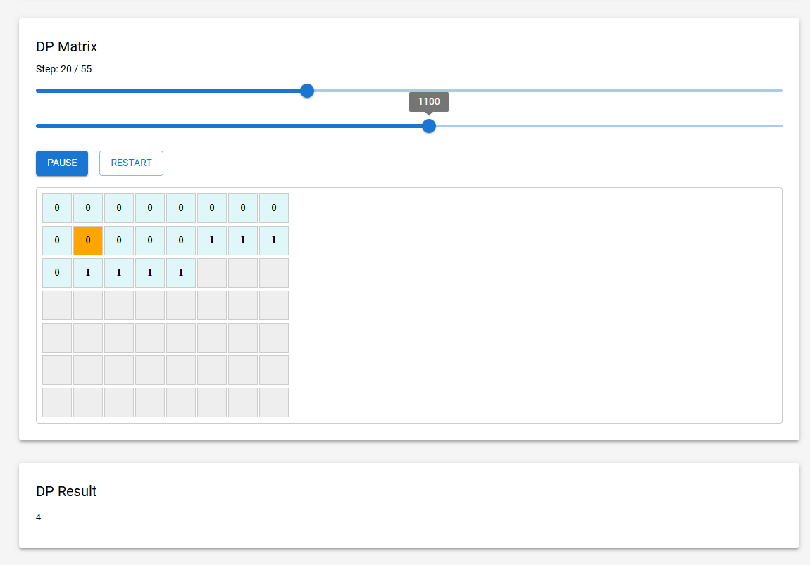
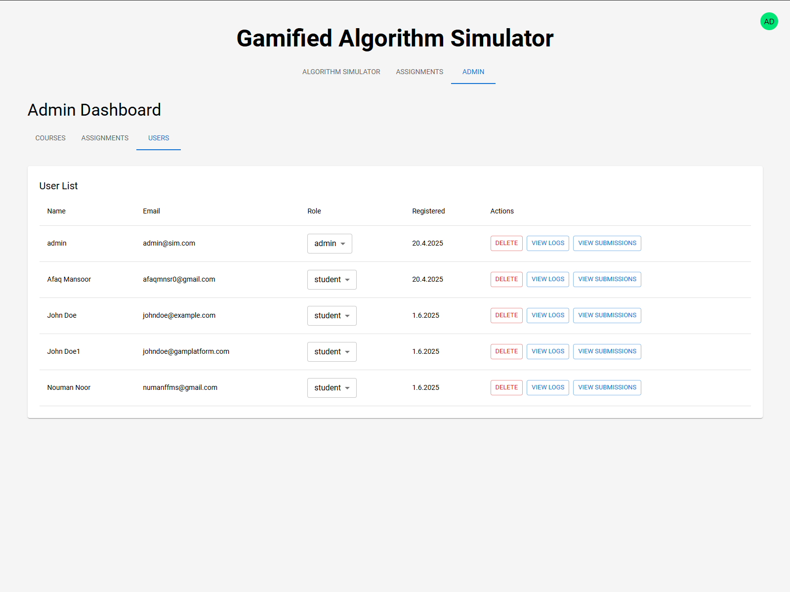

# Gamified Algorithm Simulator Platform

A full-stack educational web platform designed to teach algorithms through **interactive simulations**, **symbolic correctness checking**, and **sustainability-aware feedback**. The platform leverages gamification to motivate students, offering a visually rich, hands-on environment where learners can explore, verify, and optimize their solutions in Python and JavaScript.

Developed as part of a master's thesis at the University of Stavanger, this full-stack system aims to address key gaps in algorithm education by integrating constructivist pedagogy, sustainability metrics, and formal verification into one cohesive experience.

---

## Table of Contents

- [Motivation](#motivation)
- [Key Features](#key-features)
- [Project Structure](#project-structure)
- [Prerequisites](#prerequisites)
- [Setup Instructions](#setup-instructions)
- [Running the Full Stack](#running-the-full-stack)
- [System Architecture Overview](#system-architecture-overview)
- [Sample Endpoints](#sample-endpoints)
- [UI Overview](#ui-overview)
- [Tech Stack](#tech-stack)
- [Environment Variables](#environment-variables)
- [Deployment Notes](#deployment-notes)
- [Troubleshooting](#troubleshooting)
- [Known Limitations](#known-limitations)
- [Evaluation Instrumentation](#evaluation-instrumentation)
- [Screenshots](#screenshots)
- [Contributing](#contributing)
- [Thesis Reference](#thesis-reference)
- [License](#license)

---

## Motivation

This platform was designed to address enduring challenges in algorithm education:

- Insufficient interactive visual tools for understanding algorithm behavior  
- Lack of emphasis on correctness verification in student submissions  
- Growing demand for sustainable computing practices in computer science education  

By combining gamification, symbolic execution, and sustainability-aware feedback, this platform empowers learners to **explore, experiment, and optimize** algorithmic solutions with **real-time insights** and **unlockable progression**.  

The approach draws from constructivist pedagogy and formal methods to support deeper, more engaging computational learning.

---

## Key Features

- **Interactive Algorithm Visualizer** for graph, sorting, Petri net, and dynamic programming simulations.
- **Gamified Assignments** with unlockable tasks and a leaderboard system.
- **Symbolic Execution Engine** for correctness verification using Z3 SMT solver.
- **Sustainability Feedback** through time/memory/energy metrics.
- **Admin Panel** for course/assignment management and user tracking.
- **Multi-language Support**: Python and JavaScript execution environments.

---

## Project Structure

```text
gamified-sim-platform/
├── backend/ # Express API server + Python microservices
│ ├── controllers/ # Authentication, course, user logic
│ ├── helpers/ # Execution, scoring, seeding
│ ├── models/ # MongoDB schemas
│ ├── routes/ # API endpoints
│ ├── python-service/ # Flask-based Python code executor
│ ├── smt-service/ # Flask-based symbolic analysis using Z3
│ └── server.js
│
├── frontend/ # React + Vite frontend
│ ├── public/ace/ # Static files for Ace Editor
│ └── src/
│ ├── components/ # Simulators, visual tools, UI elements
│ ├── constants/ # Algorithm presets
│ ├── contexts/ # Auth, theme
│ ├── pages/ # Login, registration, admin
│ └── utils/ # Axios, Petri Net logic, etc.
```

---

## Prerequisites

Install the following before proceeding:

- **Node.js** ≥ v20
- **npm** (bundled with Node)
- **Python** ≥ v3.10
- **pip**
- **MongoDB** (local or cloud)
- **Vite**, **Nodemon** (optional for dev)

### Python Dependencies

Install manually or add to `requirements.txt`:

```bash
pip install flask flask-cors z3-solver
```

---

## Setup Instructions

### 1. Clone Repository

```bash
git clone https://github.com/afaqmnsr/gamified_sim_platform.git
cd gamified-sim-platform
```

### 2. Backend Setup

```bash
cd backend
npm install
```

Create `.env` file:

```env
PORT=5000
MONGO_URI=mongodb://localhost:27017/algosim
JWT_SECRET=your-secret-key
```

Start the server:

```bash
npm run dev
```

Optional: seed a default admin user

```bash
node helpers/seedAdmin.js
# Email: admin@sim.com | Password: admin123
```

### 3. Frontend Setup

```bash
cd ../frontend
npm install
```

Add `.env`:

```env
VITE_API_URL=http://localhost:5000
```

Run development server:

```bash
npm run dev
```

### 4. Python Microservices Setup

#### Python Executor

```bash
cd ../backend/python-service
python -m venv venv
source venv/bin/activate
pip install flask flask-cors z3-solver
py python_executor.py  # runs on port 7000
```

#### SMT Symbolic Verifier

```bash
cd ../smt-service
py smt_service.py  # runs on port 6000
```

---

## Running the Full Stack

Ensure the following services are running:

| Service             | URL                         |
|---------------------|-----------------------------|
| Frontend (Vite)     | http://localhost:5173       |
| Backend (Node.js)   | http://localhost:5000       |
| Python Executor     | http://localhost:7000       |
| SMT Service (Z3)    | http://localhost:6000       |

---

## System Architecture Overview



*Figure 3.1 – Platform architecture overview, based on Chapter 3 of the thesis.*

This architecture illustrates the interaction between the React-based frontend, Node.js backend, MongoDB storage, and the Python microservices handling code execution and symbolic verification.

---

## Sample Endpoints

**Run User Code:**

```bash
curl -X POST http://localhost:7000/run-python      -H "Content-Type: application/json"      -d '{"code": "def run(input_data): return 1+1"}'
```

**Run SMT Analysis:**

```bash
curl -X POST http://localhost:6000/analyze      -H "Content-Type: application/json"      -d '{"algorithmType": "symbolicExecution", "code": "def run(x): return x + 1"}'
```

---

## UI Overview

- Login/Register + Admin Dashboard
- Algorithm Selector: JavaScript or Python
- Code Editor (Ace Editor)
- Visualization outputs (bar chart, graph, matrix)
- Leaderboard and unlocked assignment tree
- Admin panel to manage users, courses, assignments, logs

---

## Tech Stack

| Layer       | Stack                              |
|-------------|-------------------------------------|
| Frontend    | React 19 + Vite + MUI + Ace Editor |
| Backend     | Node.js + Express + MongoDB        |
| Execution   | Python + Flask + Z3 Solver         |
| State Mgmt  | React Context + LocalStorage       |
| Deployment  | PM2, Nginx, Docker (recommended)   |

---

## Environment Variables

- Only `VITE_`-prefixed vars are exposed to React
- Do **not** commit `.env` files to version control
- Use `.env.example` to document necessary variables

---

## Deployment Notes

- Run `npm run build` in frontend and serve `dist/`
- Secure backend with HTTPS, CORS, and cookies
- Use production-ready services (Gunicorn, Nginx, Atlas)
- Set up proper user authentication and DB whitelisting

---

## Troubleshooting

| Issue                        | Fix                                                                 |
|-----------------------------|----------------------------------------------------------------------|
| MongoDB not connecting       | Ensure MongoDB is running locally or update `MONGO_URI`             |
| Python service fails         | Use Python 3.10+, activate venv, install all Flask packages         |
| Ace Editor not loading       | Ensure files are under `frontend/public/ace/` and Vite serves them  |
| CORS/OPTIONS error           | Update backend CORS settings for correct port and credentials       |
| Ports already in use         | Kill processes or change dev ports in .env and scripts              |

---

## Known Limitations

- **Recursive or unbounded loops** may cause symbolic analysis to hang or timeout.
- **JavaScript symbolic execution** is not yet supported—only Python is verified via Z3.
- **No live user deployment** — the system was tested locally with seeded users and manual testing.
- **Scalability constraints** may arise; sandboxing and load-handling are not yet optimized for production.

---

## Evaluation Instrumentation

While the system was not deployed in a live classroom, extensive evaluation capabilities were built-in:

- **Symbolic Logs**: Tracks assignment submissions, retries, and symbolic correctness outcomes.  
- **Sustainability Metrics**: Captures execution time, memory, and energy proxies for each run.  
- **Gamified Progression Logs**: Logs task unlocks, completion order, and leaderboard activity.

These features support future empirical studies and align with the research questions defined in the thesis (RQ1–RQ3), covering **learning outcomes**, **optimization behavior**, and **sustainability awareness**.

---

## Screenshots

| Interface | Description |
|----------|-------------|
|  | User Login |
|  | Bubble Sort Execution |
|  | Bubble Sort Visualization |
|  | Custom BFS Graph Creation |
|  | BFS Traversal Graph |
|  | Petri Net Simulator |
|  | Dynamic Programming Matrix |
|  | Gamified Unlocking |
|  | Admin: Users Tab |
|  | Admin: Submission Logs |

> See [`photos/`](./photos) folder or Appendix B of the thesis for full walkthrough.

---

## Contributing

Want to improve this platform? Submit a pull request or report issues.

📫 Contact: **am.khan@stud.uis.no**

---

## Thesis Reference

This platform was developed as part of the master's thesis:

**Title**: *Algorithm Evaluation Through Gamified Simulation: A Sustainable Approach to Computational Efficiency*  
**Author**: [Afaq Mansoor Khan](https://linkedin.com/in/afaqmnsr)  
**Institution**: [University of Stavanger, Norway](https://www.uis.no/en)  
**Degree Program**: [MSc in Computer Science](https://www.uis.no/en/studies/master-of-science-in-computer-science)  
**Year**: 2025  
**Supervisor**: [Prof. Dr. Nejm Saadallah](https://www.uis.no/nb/profile/nejm-saadallah)  
**Repository**: [GitHub](https://github.com/afaqmnsr/gamified_sim_platform)  

📄 The thesis documents the platform’s **motivation**, **pedagogical design**, **technical architecture**, **symbolic engine**, and **evaluation instrumentation**.  
Refer to Chapters 3–5 and Appendix B for implementation and UI walkthroughs.  
📥 Full thesis available upon request or via UiS archive.

---

## License

MIT License – feel free to use and adapt with credit.
