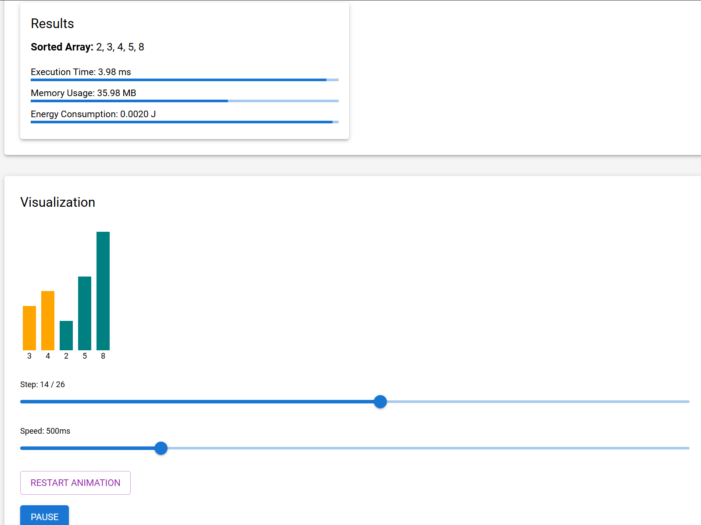
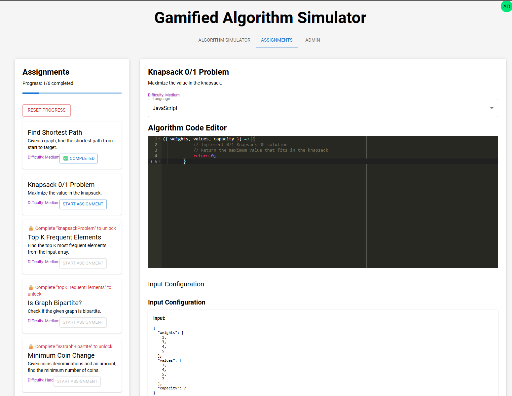
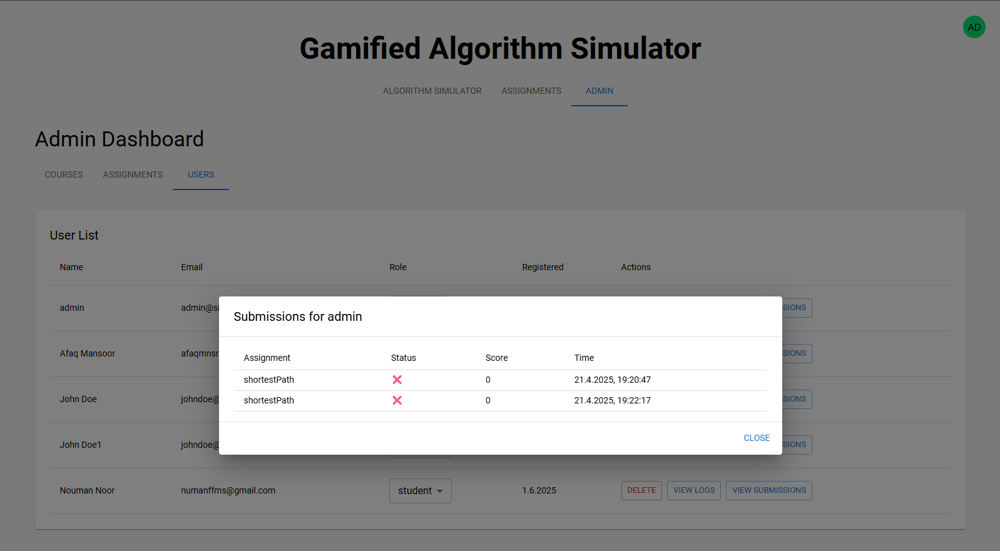

# Gamified Algorithm Simulator Platform

A full-stack educational platform that enables students to visualize, test, and optimize algorithms through gamified learning and sustainability-aware feedback. Developed as part of a Master's thesis at the University of Stavanger, the system combines interactive simulations, symbolic execution for correctness verification, and performance metrics like time, memory, and energy—providing a comprehensive and engaging approach to algorithm education.

---

## 🚀 Features

- ✨ **Interactive Algorithm Visualizer** for graph, sorting, Petri net, and dynamic programming simulations.
- 🎮 **Gamified Assignments** with unlockable tasks and a leaderboard system.
- 🧠 **Symbolic Execution Engine** for correctness verification using Z3 SMT solver.
- 🌱 **Sustainability Feedback** through time/memory/energy metrics.
- 👩‍🏫 **Admin Panel** for course/assignment management and user tracking.
- 💻 **Multi-language Support**: Python and JavaScript execution environments.

---

## 📁 Project Structure

gamified-sim-platform/
├── backend/             # Express API server + Python microservices
│   ├── controllers/     # Authentication, course, user logic
│   ├── helpers/         # Execution, scoring, seeding
│   ├── models/          # MongoDB schemas
│   ├── routes/          # API endpoints
│   ├── python-service/  # Flask-based Python code executor
│   ├── smt-service/     # Flask-based symbolic analysis using Z3
│   └── server.js
│
├── frontend/            # React + Vite frontend
│   ├── public/ace/      # Static files for Ace Editor
│   └── src/
│       ├── components/  # Simulators, visual tools, UI elements
│       ├── constants/   # Algorithm presets
│       ├── contexts/    # Auth, theme
│       ├── pages/       # Login, registration, admin
│       └── utils/       # Axios, Petri Net logic, etc.

---

## ⚙️ Prerequisites

Install the following before proceeding:

- **Node.js** ≥ v20
- **npm** (bundled with Node)
- **Python** ≥ v3.10
- **pip**
- **MongoDB** (local or cloud)
- **Vite**, **Nodemon** (optional for dev)

### Python Dependencies

Install manually or add to `requirements.txt`:

```bash
pip install flask flask-cors z3-solver
```

---

## 🛠️ Setup Instructions

### 1. Clone Repository

```bash
git clone https://github.com/username/gamified-algo-simulator.git
cd gamified-algo-simulator
```

### 2. Backend Setup

```bash
cd backend
npm install
```

Create `.env` file:

```env
PORT=5000
MONGO_URI=mongodb://localhost:27017/algosim
JWT_SECRET=your-secret-key
```

Start the server:

```bash
npm run dev
```

Optional: seed a default admin user

```bash
node helpers/seedAdmin.js
# Email: admin@sim.com | Password: admin123
```

### 3. Frontend Setup

```bash
cd ../frontend
npm install
```

Add `.env`:

```env
VITE_API_URL=http://localhost:5000
```

Run development server:

```bash
npm run dev
```

### 4. Python Microservices Setup

#### Python Executor

```bash
cd ../backend/python-service
python -m venv venv
source venv/bin/activate
pip install flask flask-cors z3-solver
py python_executor.py  # runs on port 7000
```

#### SMT Symbolic Verifier

```bash
cd ../smt-service
py smt_service.py  # runs on port 6000
```

---

## 🌐 Running the Full Stack

Ensure the following services are running:

| Service             | URL                         |
|---------------------|-----------------------------|
| Frontend (Vite)     | http://localhost:5173       |
| Backend (Node.js)   | http://localhost:5000       |
| Python Executor     | http://localhost:7000       |
| SMT Service (Z3)    | http://localhost:6000       |

---

## 🧪 Sample Endpoints

**Run User Code:**

```bash
curl -X POST http://localhost:7000/run-python      -H "Content-Type: application/json"      -d '{"code": "def run(input_data): return 1+1"}'
```

**Run SMT Analysis:**

```bash
curl -X POST http://localhost:6000/analyze      -H "Content-Type: application/json"      -d '{"algorithmType": "symbolicExecution", "code": "def run(x): return x + 1"}'
```

---

## 🖥️ UI Overview

- Login/Register + Admin Dashboard
- Algorithm Selector: JavaScript or Python
- Code Editor (Ace Editor)
- Visualization outputs (bar chart, graph, matrix)
- Leaderboard and unlocked assignment tree
- Admin panel to manage users, assignments, logs





---

## 🧩 Tech Stack

| Layer       | Stack                              |
|-------------|-------------------------------------|
| Frontend    | React 19 + Vite + MUI + Ace Editor |
| Backend     | Node.js + Express + MongoDB        |
| Execution   | Python + Flask + Z3 Solver         |
| State Mgmt  | React Context + LocalStorage       |
| Deployment  | PM2, Nginx, Docker (recommended)   |

---

## 🔐 Environment Variables

- Only `VITE_`-prefixed vars are exposed to React
- Do **not** commit `.env` files to version control
- Use `.env.example` to document necessary variables

---

## 🧰 Deployment Notes

- Run `npm run build` in frontend and serve `dist/`
- Secure backend with HTTPS, CORS, and cookies
- Use production-ready services (Gunicorn, Nginx, Atlas)
- Set up proper user authentication and DB whitelisting

---

## 🩹 Troubleshooting

| Issue                        | Fix                                                                 |
|-----------------------------|----------------------------------------------------------------------|
| MongoDB not connecting       | Ensure MongoDB is running locally or update `MONGO_URI`             |
| Python service fails         | Use Python 3.10+, activate venv, install all Flask packages         |
| Ace Editor not loading       | Ensure files are under `frontend/public/ace/` and Vite serves them  |
| CORS/OPTIONS error           | Update backend CORS settings for correct port and credentials       |

---

## 🤝 Contributing

Want to improve this platform? Submit a pull request or report issues.

📫 Contact: **am.khan@stud.uis.no**

---

## 📸 Screenshots Gallery

For a complete UI walkthrough with screenshots, see `Appendix B` or open the [`photos/`](./photos) folder.

---

## 📜 License

MIT License – feel free to use and adapt with credit.
